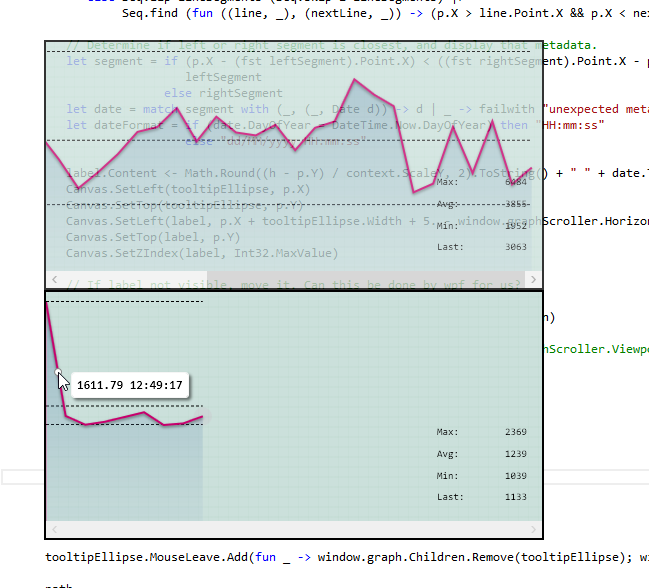

Site#
=========

A simple monitor tool for displaying a graph depicting a URL's performance with rudimentary alerting.

Displays a graph like:

* The taskbar will blink each time the maximum (top dashed line) is exceeded if the window is not focussed.
* Supports tooltips on the graph
* Settings page allows the url to be set / changed
* Multiple windows will "snap" together and can be moved as a group. Hold the shift key to unsnap a window.

License: MIT
